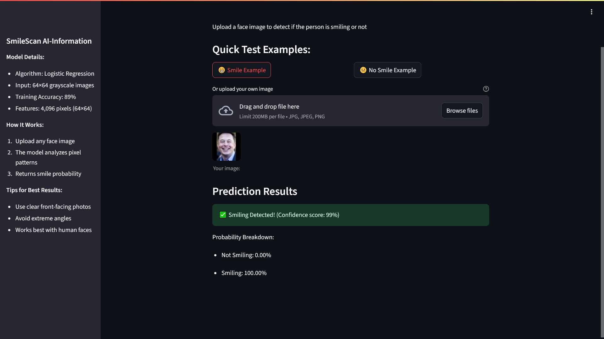

# 😊 SmileScan AI - Smile Detection App

 

A machine learning web application that detects smiles in facial images using logistic regression.

## 🚀 Features

- **Instant Prediction**: Classifies images as "Smiling" or "Not Smiling"
- **Confidence Scores**: Shows prediction probabilities
- **Easy Testing**: 
  - Pre-loaded example images
  - File upload functionality
- **Responsive Design**: Works on desktop and mobile

## 🛠️ Technical Implementation

### Model Architecture
```mermaid
graph LR
A[Input Image] --> B[Resize to 64x64]
B --> C[Convert to Grayscale]
C --> D[Flatten to 4096 features]
D --> E[Standard Scaling]
E --> F[Logistic Regression]
F --> G[Prediction]
